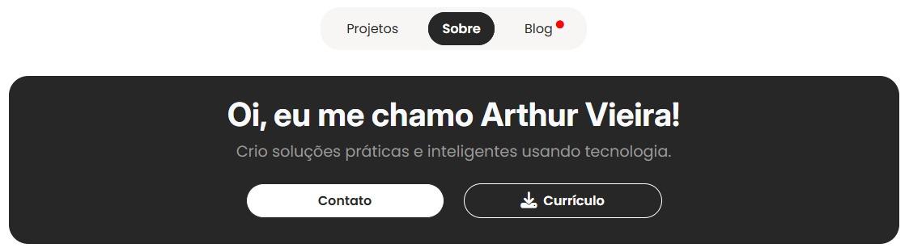
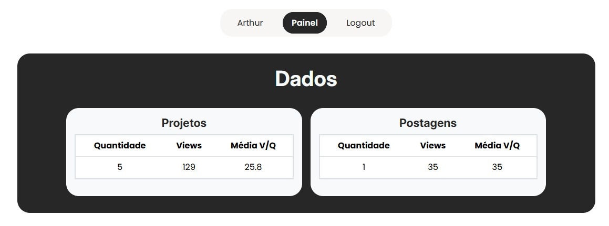
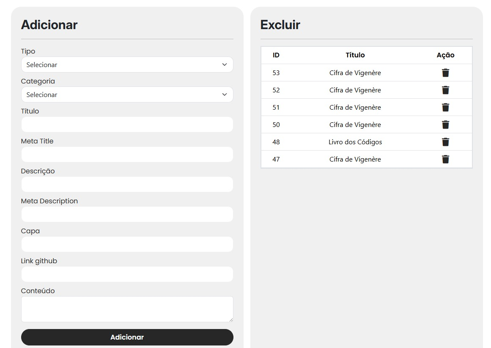
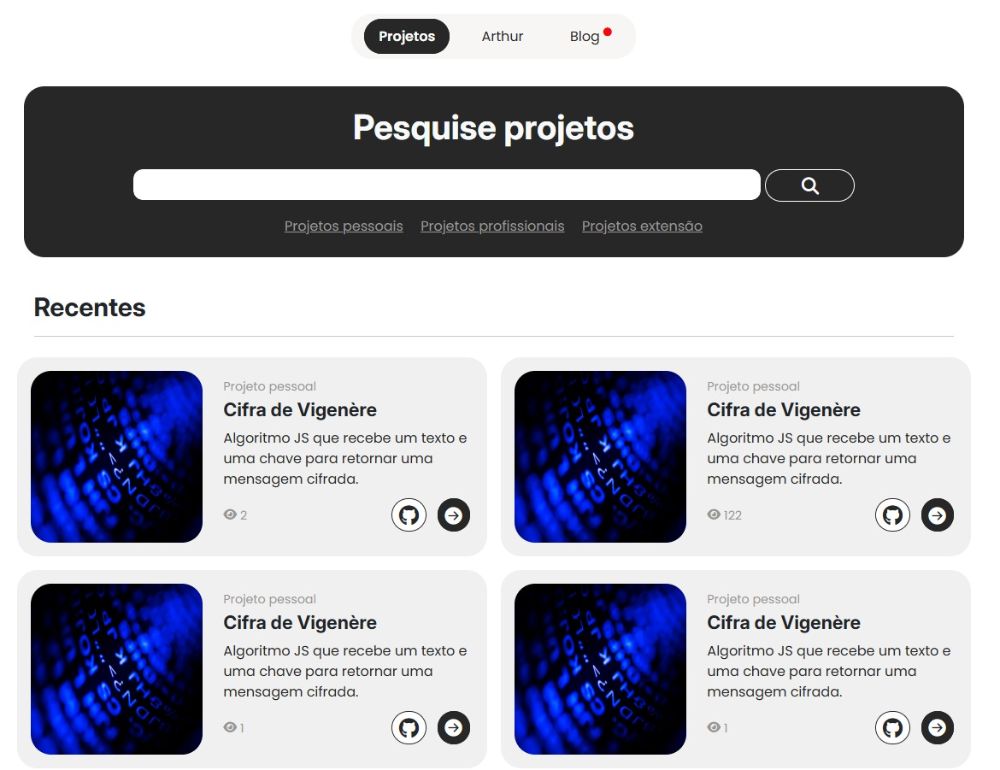
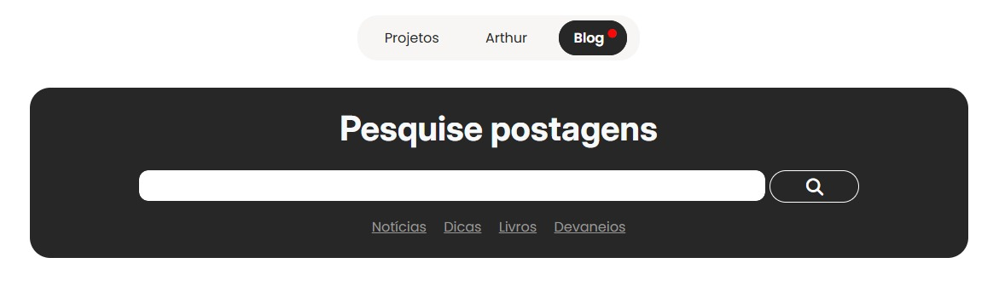
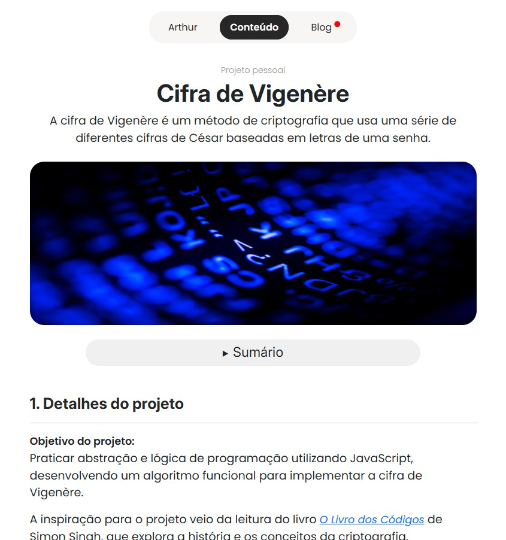
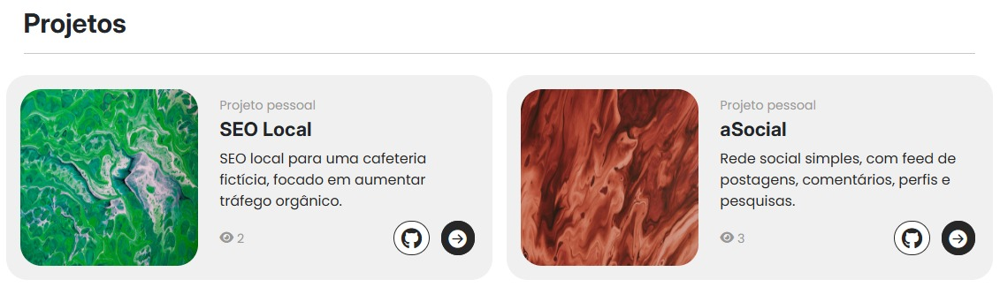
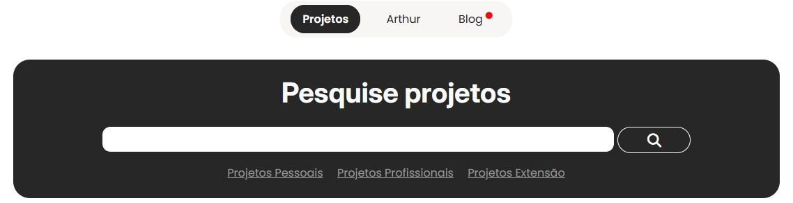
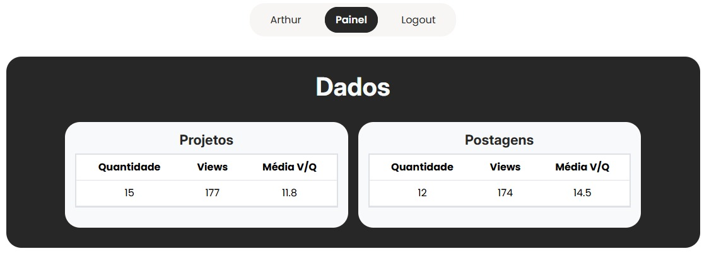
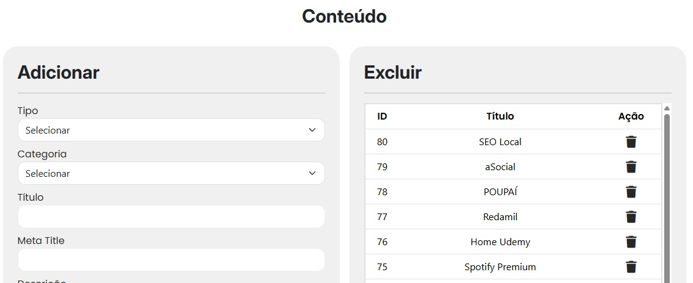

  <h1>Portfólio</h1>  

  

 

  <h2>Detalhes:</h2>

  <strong>Status</strong>: Em desenvolvimento  
  <strong>Tempo em desenvolvimento</strong>: Aproximadamente 4 dias contando deste a prototipagem.   

  <h2>O que foi utilizado no projeto:</h2>

<ul>
  <li>Figma (prototipagem)</li>
  <li>HTML</li>
  <li>CSS</li>
  <li>Bootstrap 5</li>
  <li>PHP</li>
  <li>phpMyAdmin</li>
  <li>SQL</li>
</ul>

  <h2>O que o sistema faz:</h2>

<ul>
  <li>Entrega para o visitante os meus projetos e postagens do blog</li>
  <li>Adiciona conteúdo de modo dinâmico usando um form no painel, e na págína conteúdo.php uma função recupera o conteúdo pelo id usando GET</li>
  <li>A cada fez que a página de um conteúdo é aberta adiciona uma visualização e também sugere duas outras postagens</li>
  <li>Barra de pesquisa para projetos e postagens do blog</li>
  <li>No painel de gerenciamento apresenta dados sobre projetos e postagens do blog (quantidade, total de visualizações...)</li>
</ul>

  <h2>Melhorias:</h2>

<ul>
  <li>Aprender e implementar prepared statement para diminuir a possibilidade de SQL Injection</li>
  <li>Aprender a criar URL's de modo dinâmico usando slug sobre conteúdo</li>
  <li>Aprender a criar uma forma de enviar o conteúdo de modo mais amigável (atualmente o input de conteúdo da postagem é um text área que recebe html puro, quero aprender a fazer algo como se fosse um arquivo word...)</li>
</ul>

  <h2>Painel de gerenciamento</h2>  

  

  

  <h2>Pesquisa (projeto/blog)</h2>  

  

  

  <h2>Página de conteúdo (projeto/blog)</h2>  

  

  

  

  

  

  

  

